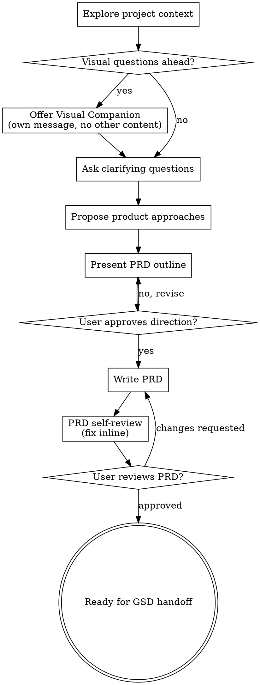

# Brainstorming Ideas Into PRDs

Use this skill to turn a rough idea into a clear product requirements document (PRD) that can later be handed to get-shit-done for planning and implementation.

Start by understanding the current project context, then ask questions one at a time to refine the idea. Once you understand what should be built, present the PRD direction and get user approval before writing the PRD file.

<HARD-GATE>
Do NOT write code, scaffold projects, create technical specs, create implementation plans, update ROADMAP/PLAN files, or invoke GSD or other implementation skills during this skill.

The terminal state of this skill is a reviewed PRD saved under `prds/YYYY-MM-DD-<topic>/PRD.md`. After the PRD is approved, stop and tell the user it is ready to feed into get-shit-done.
</HARD-GATE>

## Checklist

Create a task for each item and complete them in order:

1. **Explore project context** - check files, docs, existing PRDs, planning artifacts, and recent commits
2. **Offer visual companion** - only if upcoming questions would benefit from mockups, diagrams, or visual comparisons
3. **Ask clarifying questions** - one at a time, focused on user value, scope, constraints, and success criteria
4. **Propose 2-3 product approaches** - explain trade-offs and lead with a recommendation
5. **Present PRD outline** - validate the major sections and product direction before writing
6. **Write PRD** - save to `prds/YYYY-MM-DD-<topic>/PRD.md`
7. **PRD self-review** - fix placeholders, contradictions, ambiguity, missing acceptance criteria, and scope creep
8. **User reviews PRD** - revise until approved
9. **Stop for GSD handoff** - do not create specs, plans, or implementation tasks

## Process Flow



## The Process

### Understand The Idea

- Check the current project state before asking detailed questions.
- Look for existing PRDs under `prds/`, GSD artifacts under `.planning/`, docs, README files, and recent commits.
- If the request spans multiple independent products or subsystems, help decompose it before writing a PRD.
- Ask one question per message. Prefer multiple-choice questions when they make the answer easier.
- Focus on product intent: who it is for, what problem it solves, what success looks like, and what is out of scope.

### Explore Approaches

- Propose 2-3 product approaches with trade-offs.
- Lead with the recommended approach and explain why it best fits the project context.
- Keep technical details at the level needed to clarify product scope. Do not turn the discussion into an implementation plan.

### Present The PRD Direction

Before writing the file, present the intended PRD structure and major decisions. Scale the detail to the idea:

- Simple changes may need a short outline.
- Larger features should validate goals, non-goals, user stories, requirements, UX notes, acceptance criteria, risks, and open questions.

Ask whether the direction looks right before writing the PRD.

### Write The PRD

Save the final PRD to:

`prds/YYYY-MM-DD-<topic>/PRD.md`

Use a kebab-case topic slug. Create the `prds/` directory if needed. Do not commit unless the user asks.

Use this structure by default:

```markdown
# <Feature Name> PRD

## Background

## Problem

## Goals

## Non-Goals

## Target Users

## User Stories

## Requirements

## UX / Interaction Notes

## Data / Integration Needs

## Acceptance Criteria

## Risks

## Open Questions

## GSD Handoff Notes
```

Keep `GSD Handoff Notes` focused on context that will help later planning: suggested phase boundaries, important constraints, likely dependencies, and unresolved decisions. Do not write implementation tasks, task estimates, code-level steps, or PLAN.md content.

## PRD Self-Review

After writing the PRD, review it with fresh eyes:

1. **Placeholder scan:** Remove "TBD", "TODO", empty sections, and vague filler.
2. **Internal consistency:** Make sure goals, requirements, non-goals, and acceptance criteria agree.
3. **Scope check:** Confirm the PRD is focused enough for GSD to plan from. If not, split it.
4. **Acceptance check:** Ensure each important requirement has a way to verify success.
5. **Ambiguity check:** If a requirement could be interpreted two ways, choose one or mark it as an open question.

Fix issues inline before asking the user to review.

## User Review Gate

After the PRD review loop passes, ask the user to review the written PRD:

> "PRD written to `<path>`. Please review it and tell me what you want changed before we hand it to GSD."

Wait for the user's response. If they request changes, update the PRD and rerun the self-review. Only stop once the user approves or explicitly pauses.

## GSD Handoff

Once the user approves the PRD:

- Do not invoke GSD automatically.
- Do not create a spec, PLAN.md, ROADMAP.md, task breakdown, or code changes.
- Tell the user the PRD is ready for get-shit-done and include the PRD path.

## Key Principles

- **One question at a time** - keep the conversation easy to answer
- **Product first** - clarify user value and scope before implementation detail
- **YAGNI ruthlessly** - remove unneeded features from the PRD
- **Explicit non-goals** - help GSD avoid accidental scope expansion
- **Acceptance criteria matter** - make success testable without prescribing code
- **Stop at handoff** - PRD creation is the final output of this skill

## Visual Companion

A browser-based companion can show mockups, diagrams, and visual options during brainstorming. Available as a tool, not a mode. Accepting the companion means it is available for questions that benefit from visual treatment; it does not mean every question goes through the browser.

**Offering the companion:** When you anticipate that upcoming questions will involve visual content, offer it once for consent:
> "Some of what we're working on might be easier to explain if I can show it to you in a web browser. I can put together mockups, diagrams, comparisons, and other visuals as we go. This feature is still new and can be token-intensive. Want to try it? (Requires opening a local URL)"

This offer must be its own message. Do not combine it with clarifying questions, context summaries, or other content. Wait for the user's response before continuing. If they decline, proceed with text-only brainstorming.

**Per-question decision:** Even after the user accepts, decide for each question whether to use the browser or the terminal. The test: would the user understand this better by seeing it than reading it?

- **Use the browser** for visual content: mockups, wireframes, layout comparisons, architecture diagrams, and side-by-side visual designs.
- **Use the terminal** for text content: requirements questions, conceptual choices, tradeoff lists, scope decisions, and acceptance criteria.

If they agree to the companion, read the detailed guide before proceeding:
`visual-companion.md`
